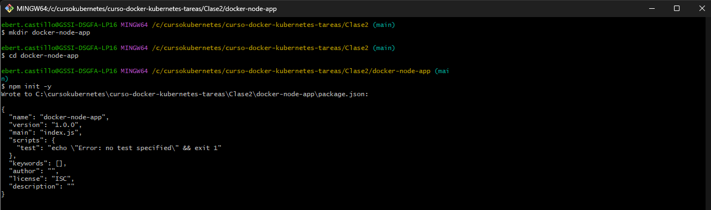
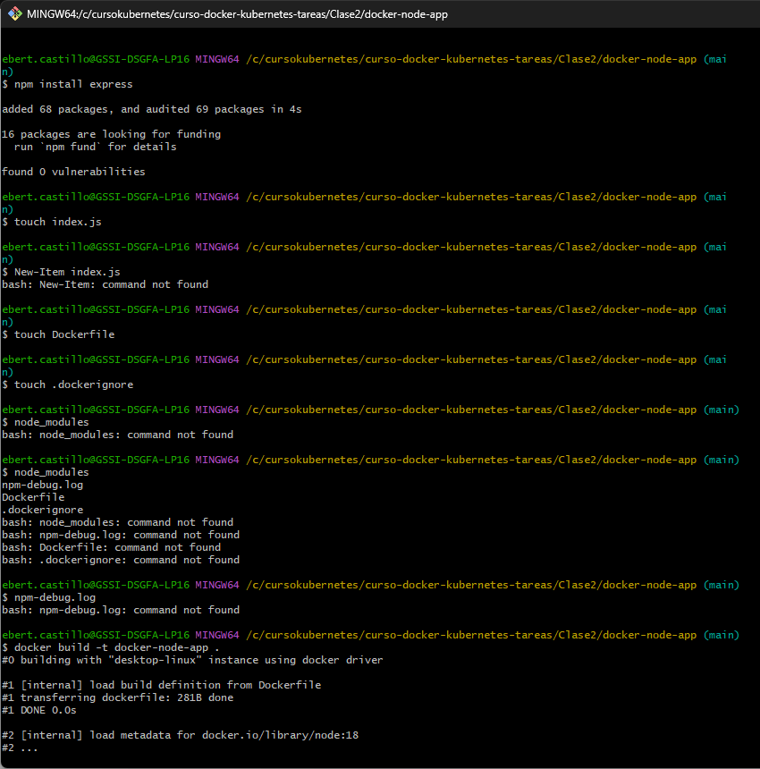
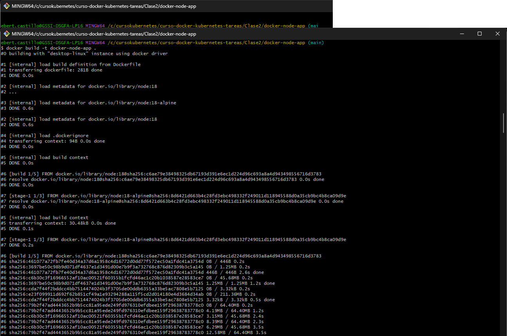
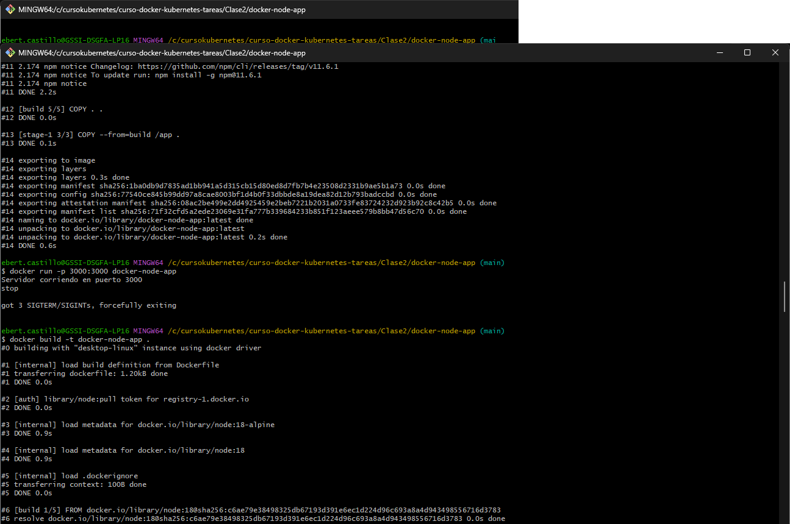
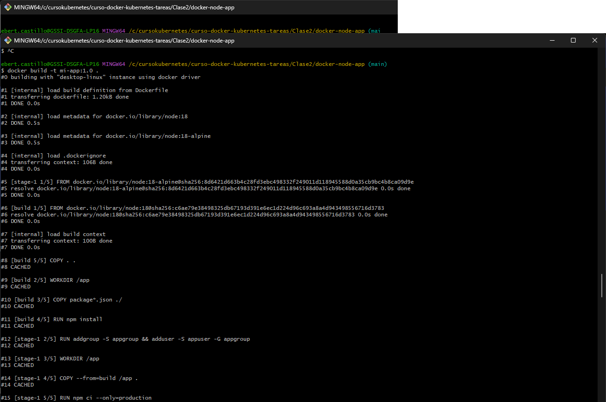
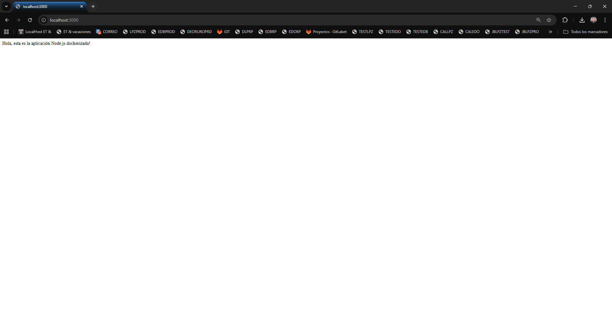
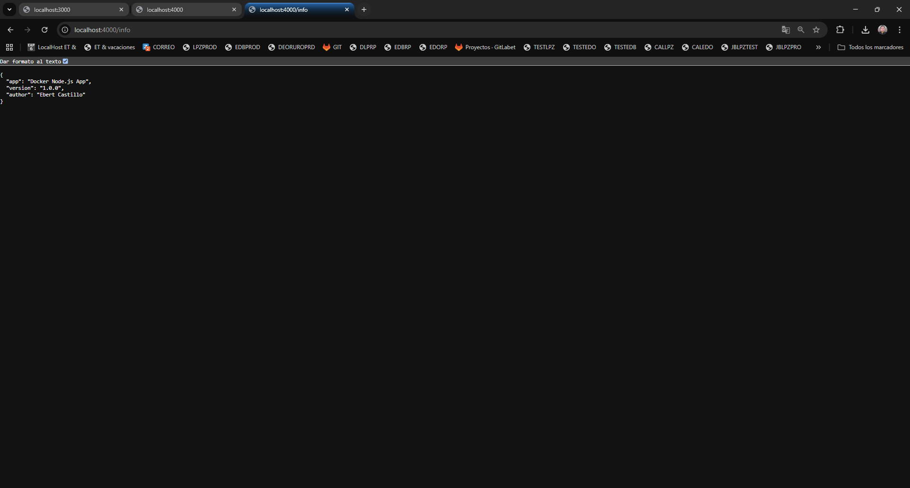

Tarea 2 - Dockerizar Aplicación con Multi-Stage Build
Objetivo
Aplicar los conocimientos de Dockerfiles y multi-stage builds para containerizar una aplicación propia, optimizarla y publicarla en Docker Hub.

Parte 1: Elegir o Crear una Aplicación
Elige una de las siguientes opciones:

Opción 1: Aplicación Node.js
Crea o usa una aplicación Node.js/Express con:

Al menos 2 endpoints HTTP
go.mod para dependencias
Compilación estática

capturas de lo obtenido

