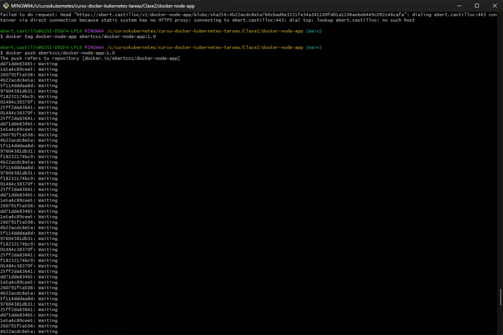
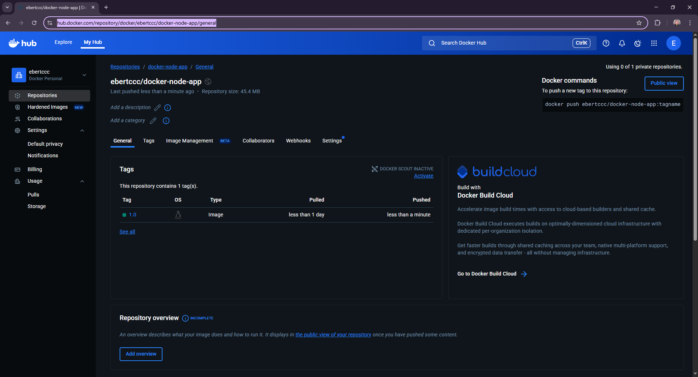

# Clase 2 - Dockerización de Mi Aplicación

## Aplicación

**Lenguaje:** Node.js
**Framework:** Express
**Descripción:** API REST para gestión de tareas

**Endpoints:**

const express = require("express");
const app = express();

const PORT = process.env.PORT || 3000;

// Endpoint 1
app.get("/", (req, res) => {
  res.send("Hola, esta es la aplicación Node.js dockerizada!");
});

// Endpoint 2
app.get("/info", (req, res) => {
  res.json({
    app: "Docker Node.js App",
    version: "1.0.0",
    author: "Ebert Castillo"
  });
});

app.listen(PORT, () => {
  console.log(`Servidor corriendo en puerto ${PORT}`);
});

**package.json**
{
  "name": "docker-node-app",
  "version": "1.0.0",
  "description": "Ejemplo de aplicación Node.js dockerizada",
  "main": "index.js",
  "scripts": {
    "start": "node index.js"
  },
  "dependencies": {
    "express": "^4.18.2"
  }
}

**Dockerfile multi-stage**

# Stage 1: Build
FROM node:18 AS build

WORKDIR /app

COPY package*.json ./
RUN npm install

COPY . .

# Stage 2: Production
FROM node:18-alpine

WORKDIR /app

COPY --from=build /app .

EXPOSE 3000

CMD ["node", "index.js"]

**Crear archivo .dockerignore**

node_modules
npm-debug.log
Dockerfile
.dockerignore

**ejecutar el contenedor**

capturas de lo obtenido

**## Docker Hub**

https://hub.docker.com/repository/docker/ebertccc/docker-node-app/general

