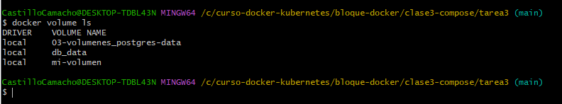

# Nginx + PostgreSQL - Tarea 3

**Curso:** Docker & Kubernetes - Clase 3  
**Estudiante:** EBERT CASTILLO CORTTEZ

Aplicación multi-contenedor con Nginx (contenido estático), PostgreSQL y Adminer.  
Demuestra redes, volúmenes y persistencia de datos.

## CREACION DE HTML COMPOSE. YML 

## verificacion de compose

## Servicios corriendo:

## Volumen persistente

