# Microservicios con Cache y Gateway

## Descripción

**Nombre del proyecto:** dockerMicroserviciosEbertCastilloCortez 
**Descripción:** Aplicación de blog con microservicios, usando Redis como cache, MongoDB como base de datos, Node.js como backend, Nginx como gateway y frontend estático.  
**Tecnologías utilizadas:** Docker, Docker Compose, Node.js, Express, Redis, MongoDB, Nginx, HTML.

---

## Servicios

| Servicio  | Tecnología | Puerto | Descripción                    |
|-----------|------------|--------|--------------------------------|
| gateway   | Nginx      | 8080   | API Gateway                    |
| backend   | Node.js    | 5000   | API de posts                   |
| redis     | Redis      | 6379   | Cache de posts                 |
| db        | MongoDB    | 27017  | Base de datos                  |
| frontend  | Nginx      | 80     | Interfaz web estática          |

## Creamos el Proyecto Clase 4

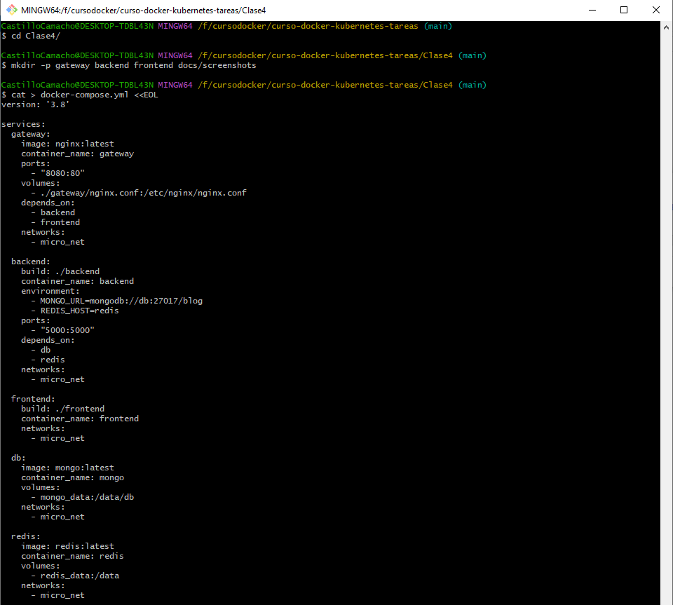

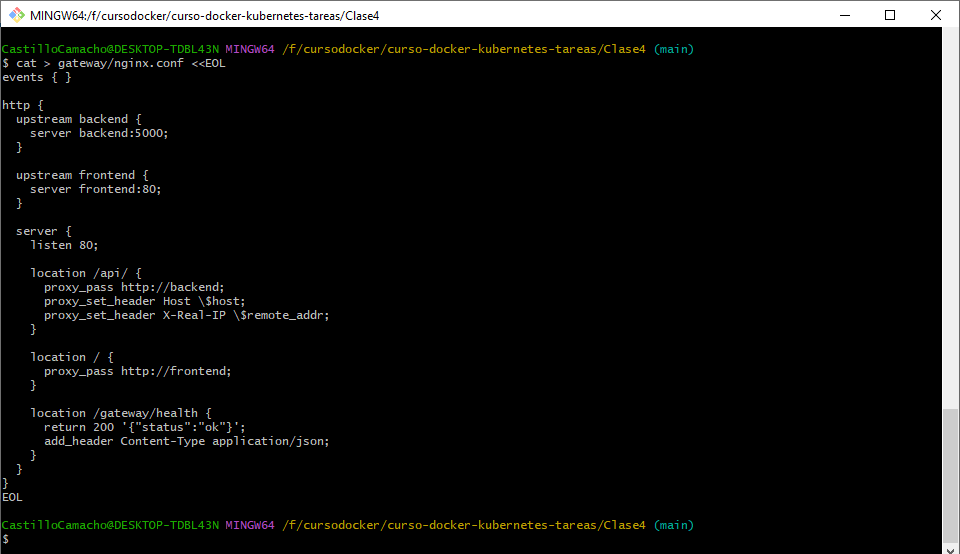

## Levantamos servicios 

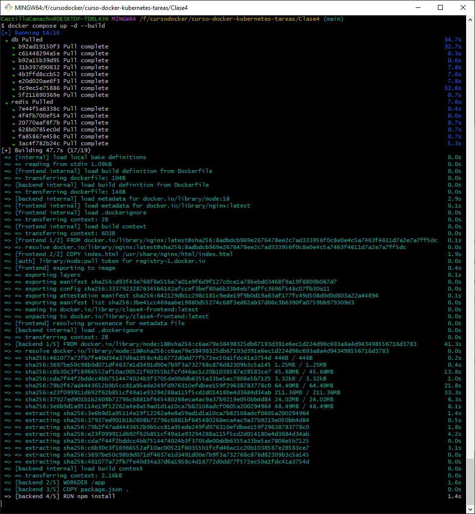

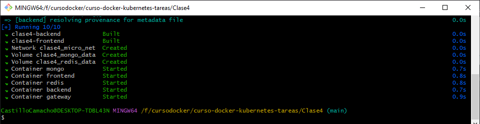

## Verificamos los navegadores

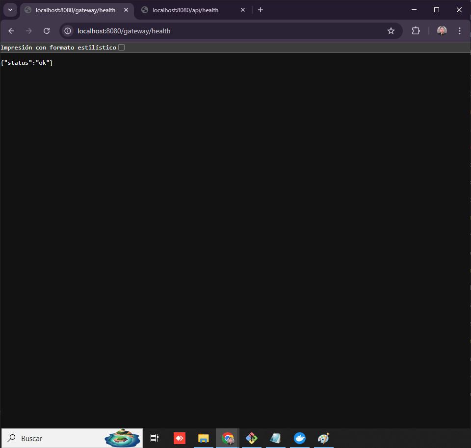

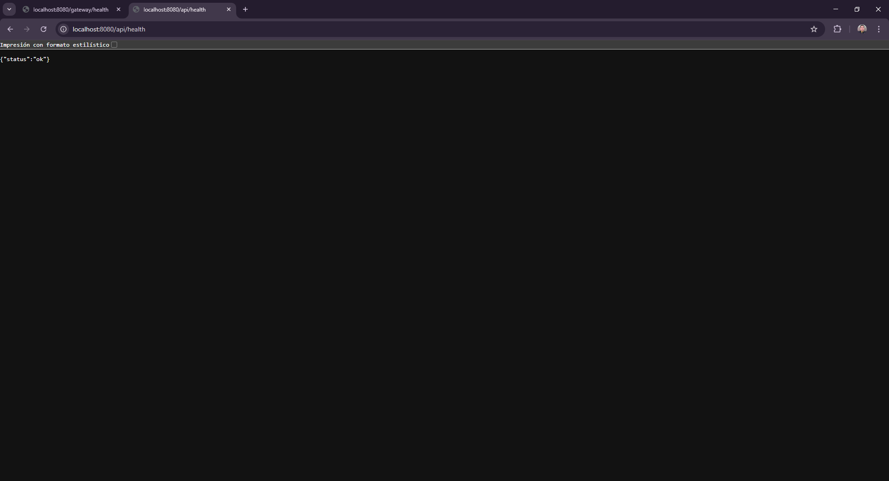

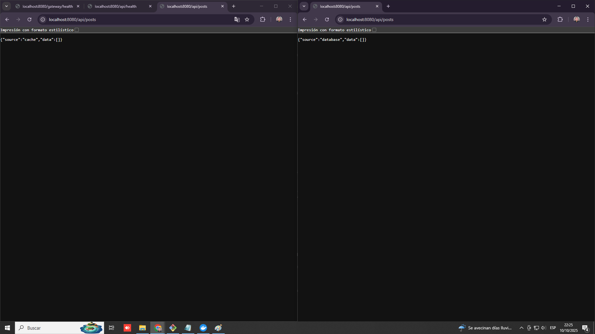

## Logs

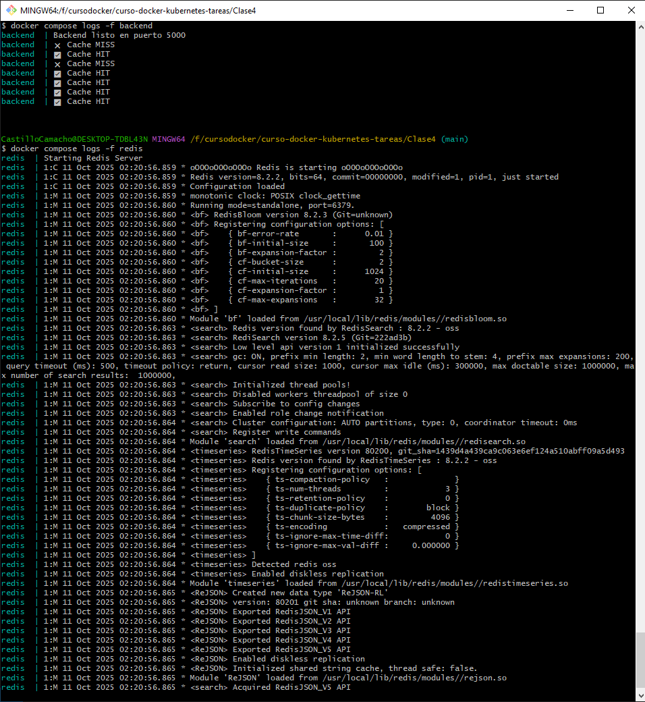

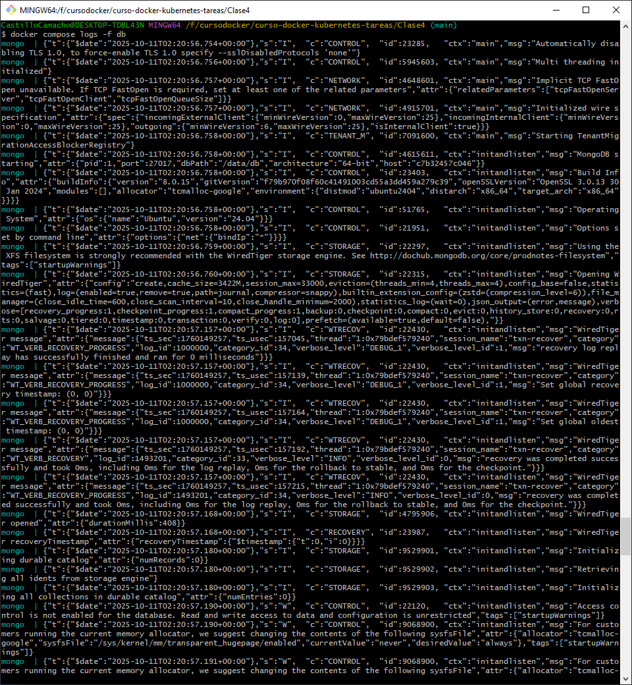

## Pruebas 

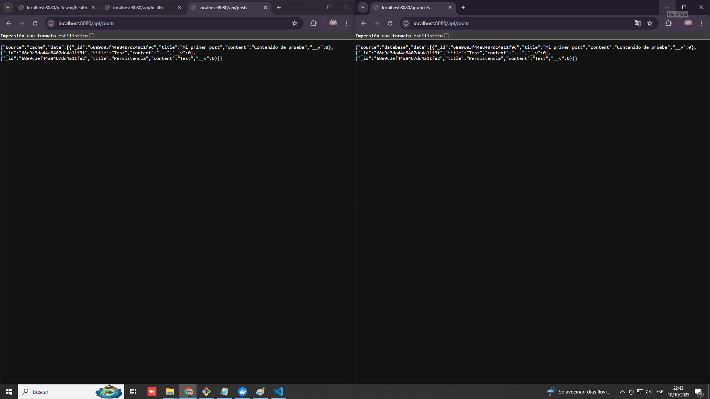

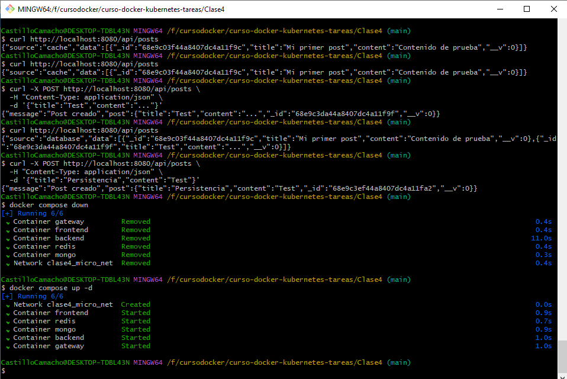

