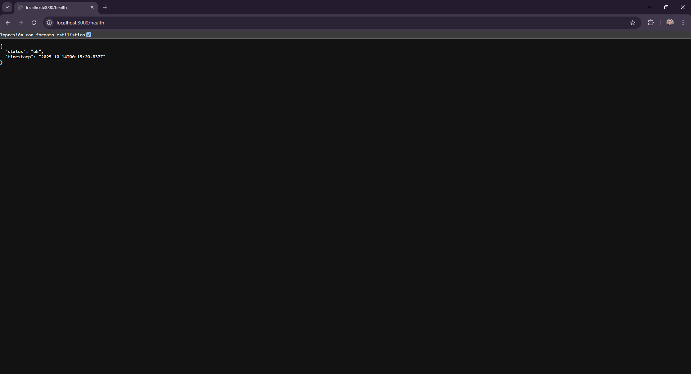

# Curso Docker y Kubernetes - Tareas

**Autor:** Ebert Castillo  
# Tarea 5 Seguridad y Optimización de Imágenes Objetivo
---

## Codigo Backend

## index.js

const express = require('express');
const routes = require('./routes');

const app = express();
const PORT = process.env.PORT || 3000;

app.use(express.json());
app.use('/', routes);

// health endpoint simple
app.get('/health', (req, res) => {
  res.json({ status: 'ok', timestamp: new Date().toISOString() });
});

app.listen(PORT, () => {
  console.log(`Server listening on port ${PORT}`);
});

## routes.js

const express = require('express');
const router = express.Router();

router.get('/', (req, res) => {
  res.json({ message: 'mi-app funcionando', uptime: process.uptime() });
});

// ejemplo: endpoint que usa DB URI (demostración)
router.get('/info', (req, res) => {
  res.json({
    app: 'mi-app-ecc',
    node_env: process.env.NODE_ENV || 'development',
    db: process.env.MONGO_URI ? 'configured' : 'not configured'
  });
});

module.exports = router;

## package.json

{
  "name": "mi-app-ecc",
  "version": "1.0.0",
  "description": "Aplicación demo para tarea de seguridad y optimización de imágenes",
  "main": "src/index.js",
  "scripts": {
    "start": "node src/index.js",
    "start:dev": "nodemon src/index.js"
  },
  "keywords": [],
  "author": "Tu Nombre",
  "license": "MIT",
  "dependencies": {
    "express": "^4.18.2"
  }
}

## Dockerfile

## dockerignore 

node_modules
npm-debug.log
Dockerfile
.dockerignore
.git
.gitignore
docs
*.md

## docker-compose.yml  

  backend:
    build:
      context: ./backend
      dockerfile: Dockerfile
    image: mi-app:optimizado
    container_name: mi-app-backend
    ports:
      - "3000:3000"
    environment:
      - NODE_ENV=production
      - PORT=3000
      - MONGO_URI=mongodb://mongo:27017/miapp
    depends_on:
      - mongo
    restart: unless-stopped

  mongo:
    image: mongo:6
    container_name: mi-app-mongo
    volumes:
      - mongo-data:/data/db
    environment:
      MONGO_INITDB_DATABASE: miapp
    restart: unless-stopped

volumes:
  mongo-data:

## Cconstruir la imagen y levantar los servicios

 

 

## funcionamiento 

docker ps 

## Escanear la imagen con TRIVY

trivy image mi-app:optimizado

 

 

## VULNERAVILIDADES CRITICAS 
trivy image --severity CRITICAL,HIGH mi-app:optimizado

 

## Reporte 

## LOG

