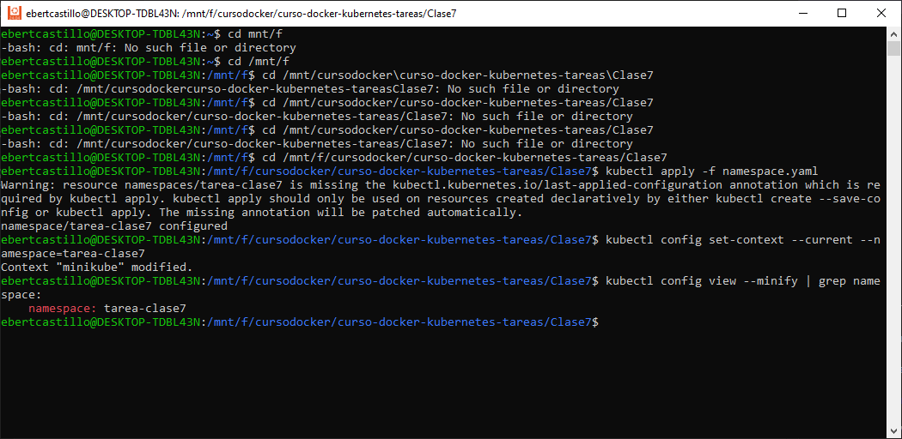
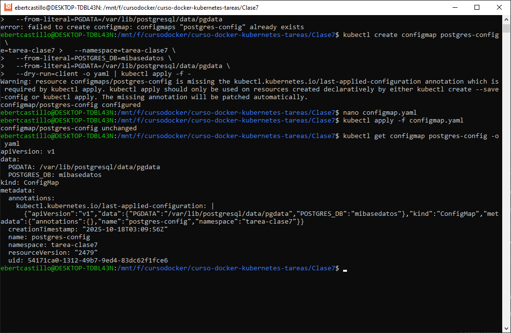
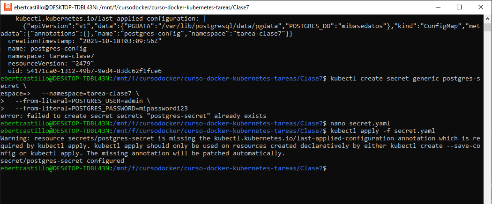
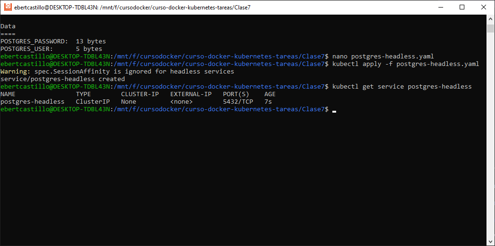
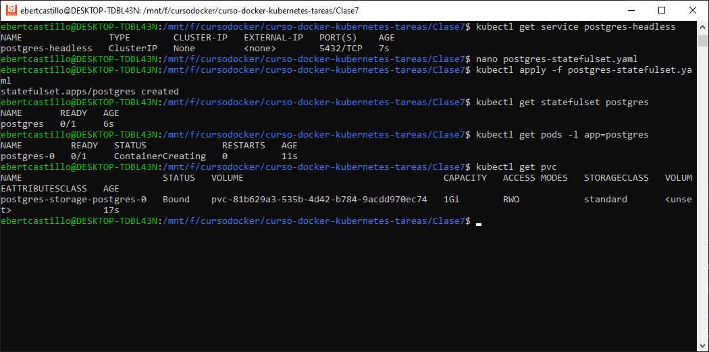
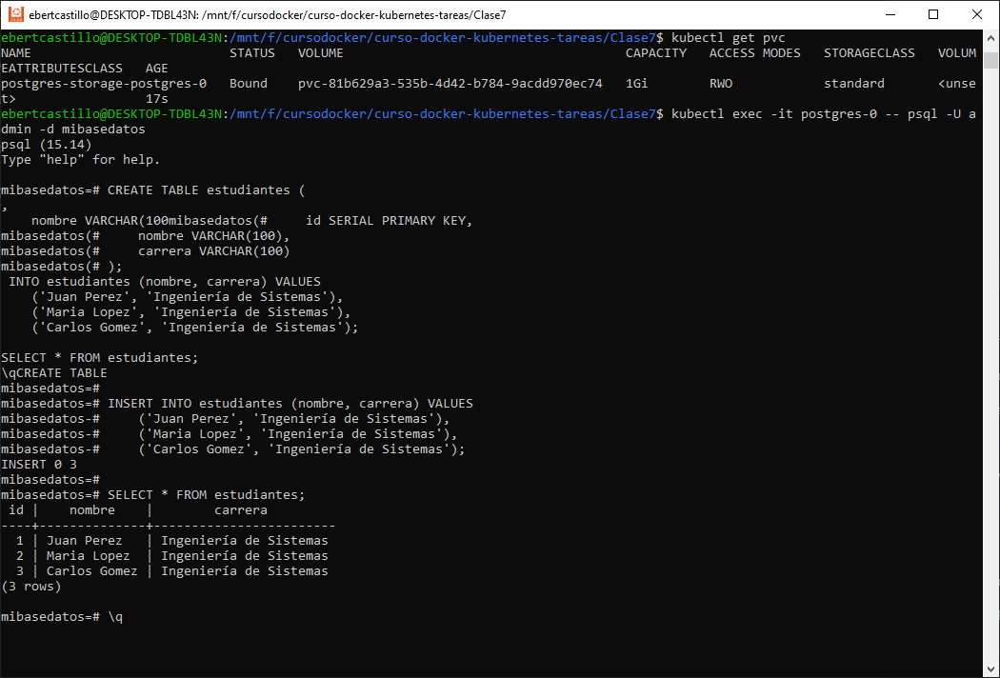
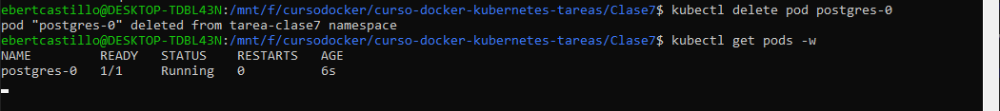
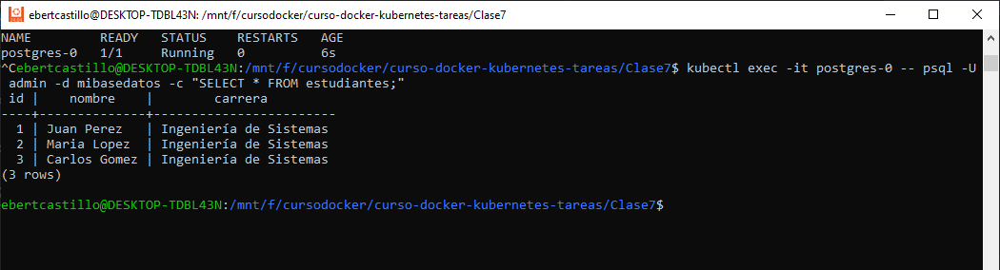

# Webapp 

**Curso:** Docker & Kubernetes - Clase 7 
**Estudiante:** Ebert Castillo Cortez 

## Objetivo

Aplicar los conceptos de Namespaces, ConfigMaps, Secrets y StatefulSets desplegando PostgreSQL con persistencia en Kubernetes.

Nota importante: Esta tarea se enfoca en los conceptos de Kubernetes, NO en desarrollo de aplicaciones. Usarás imágenes pre-construidas.

## Namespace dedicado

## ConfigMap para configuración no sensible

## Secret para credenciales

## StatefulSet con persistencia (PVC)  -- Headless Service para acceso interno

## Probar PostgreSQL

** kubectl exec -it postgres-0 -- psql -U admin -d mibasedatos

CREATE TABLE estudiantes (
    id SERIAL PRIMARY KEY,
    nombre VARCHAR(100),
    carrera VARCHAR(100)
);

INSERT INTO estudiantes (nombre, carrera) VALUES
    ('Juan Perez', 'Ingeniería de Sistemas'),
    ('Maria Lopez', 'Ingeniería de Sistemas'),
    ('Carlos Gomez', 'Ingeniería de Sistemas');

SELECT * FROM estudiantes;
\q

## Demostrar persistencia

kubectl delete pod postgres-0
kubectl get pods -w 

