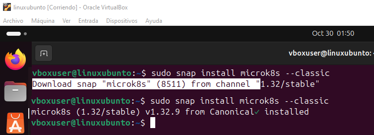
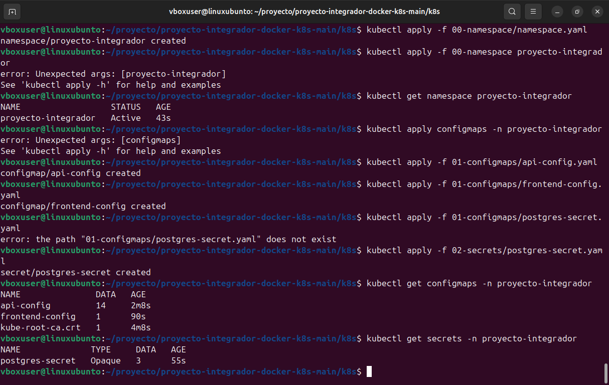
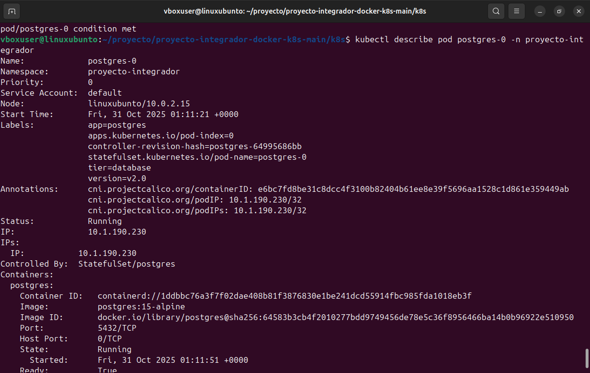
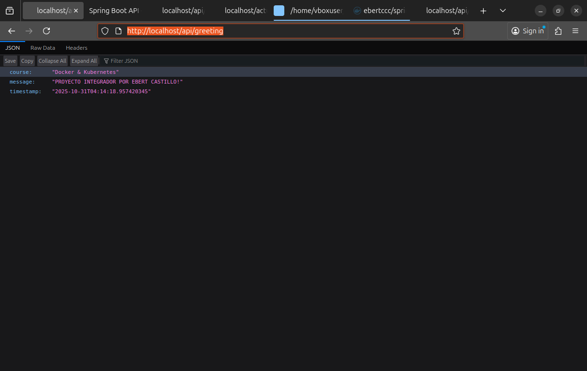
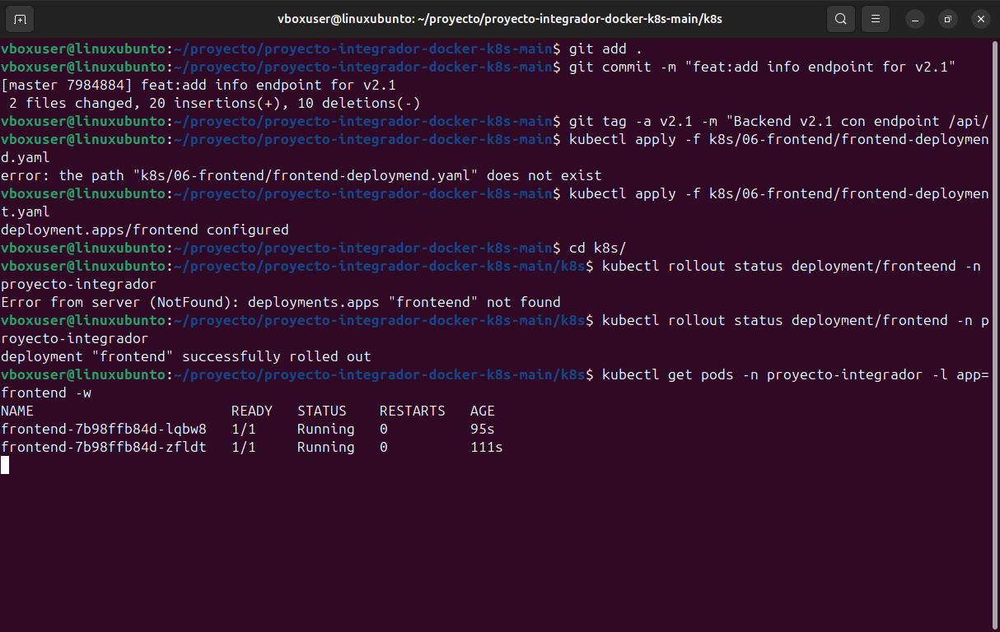

# Proyecto Final - Curso Docker & Kubernetes

**Curso:** Docker & Kubernetes - Contenedores y Orquestación en la Práctica

**Instructor:** Alejandro Fiengo

**Institución:** i-Quattro

**Nombre Completo:** Ebert Castillo Cortez  **CI** 5959351

## Objetivo

Aprender el workflow profesional de actualización y gestión de versiones de aplicaciones en Kubernetes, utilizando microk8s como entorno de desarrollo local que simula un cluster cloud.

**Docker HUB frontend**

https://hub.docker.com/repository/docker/ebertccc/angular-frontend/general

**Docker HUB backend**

https://hub.docker.com/repository/docker/ebertccc/springboot-api/general


## Parte 1: Setup del Ambiente (15%)

#### 1.1 Crear Máquina Virtual (Opción A) o Instancia Cloud (Opción B)

**Si usas VirtualBox o VMware:**
- Descargar Ubuntu 24.04 Desktop LTS
- Crear VM en tu hypervisor:
  - **Nombre:** ebertccc-k8s
  - Tipo: Linux Ubuntu (64-bit)
  - RAM: 4096 MB
  - CPU: 2 cores
  - Disco: 25 GB (dinámico)
  - Red: NAT o Bridged

**UBUNTU**


#### 1.2 Instalar microk8s

# Actualizar sistema
# Instalar microk8s
# Agregar usuario al grupo
# Verificar instalación
# Crear alias (opcional pero recomendado)


#### 1.3 Habilitar Addons

# Habilitar addons necesarios
# Habilitar MetalLB (reemplaza el rango con IPs de tu red local)
# Verificar que todos estén activos


#### 1.4 Instalar Git y Docker

# Git
# Docker
# Verificar instalación de Docker
# Login en Docker Hub (necesario para push)


#### 1.5 Obtener y Desplegar Proyecto Integrador v2.0

# Descargar el archivo .zip desde Moodle y extraerlo

# Inicializar repositorio Git local (para tus cambios v2.1 y v2.2)

#### 1.6 Desplegar y Verificar Funcionamiento del Proyecto v2.0 Base

# Despliegue - Kubernetes (microk8s)
Desplegar el Proyecto Integrador v2.0 en **microk8s**.

## Requisitos Previos
### 1. Verificar que microk8s esté corriendo




### 2. Verificar conectividad del cluster
### 3. Habilitar Ingress Controller
### 4. Habilitar Metrics Server (para HPA)
### 5. Habilitar DNS (si no está habilitado)
### 6. Habilitar Storage (si no está habilitado)
### 7. Habilitar MetalLB (Opcional pero recomendado)

**Verificar:**


### 8. Preparar las Imágenes Docker

#### Opción B: Importar imágenes desde Docker local

**Desde el directorio raíz del proyecto:**
**Verificar que las imágenes estén en microk8s:**
**Nota:** El comando `microk8s ctr` puede requerir `sudo` dependiendo de la configuración de permisos del sistema.


## Paso 0: Namespace



## Paso 1: Configuración (ConfigMaps y Secrets)
**Verificar:**


## Paso 2: Base de Datos (PostgreSQL con StatefulSet)
### 2.1 Crear Headless Service
### 2.2 Crear StatefulSet con PersistentVolumeClaim
### 2.3 Esperar a que PostgreSQL esté listo

**Verificar:**
# Ver estado del pod 




# Ver eventos
# Ver logs


## Paso 3: Cache (Redis)
**Verificar:**


## Paso 4: Backend (Spring Boot API)

### 4.1 Desplegar API
### 4.2 Esperar a que la API esté lista (puede tomar 2-3 minutos)
**Verificar:**


## Paso 5: Frontend (Angular)
**Verificar:**


## Paso 6: Ingress (Routing HTTP)
**Verificar:**


## Paso 7: HPA (Horizontal Pod Autoscaler)
**Verificar:**


### Cómo funciona el Ingress en microk8s

En microk8s, el Ingress Controller expone los puertos 80 y 443 **directamente en el host** usando `hostPort`.


### Verificacion de lo desplegado
**Endpoints disponibles:**
- **Frontend:** http://localhost/
- **API Greeting:** http://localhost/api/greeting
- **API Users:** http://localhost/api/users
- **Health Check:** http://localhost/actuator/health


## Actualizar la Aplicación Después de Modificar el Código

## Parte 2: 
**Iteración v2.1 - Modificar Backend**

### Objetivo
Agregar un nuevo endpoint en el backend, versionar la imagen como v2.1, publicarla en tu Docker Hub y actualizar el deployment.

### Tareas
#### 2.1 Agregar Nuevo Endpoint


#### 2.2 Build Imagen Docker v2.1


#### 2.3 Push a Docker Hub


#### 2.4 Actualizar Deployment de Kubernetes


#### 2.5 Aplicar Cambios


#### 2.6 Verificar Funcionamiento



## Parte 3: Iteración v2.2 - Modificar Frontend 

### Objetivo
Agregar funcionalidad en el frontend para consumir el nuevo endpoint `/api/info`, versionar como v2.2 y desplegar.

### Tareas

#### 3.1 Modificar Frontend Angular

Editar: `frontend/src/app/app.component.html`
<div class="form-group">
  <button (click)="getSystemInfo()" class="btn-primary">
    Ver Info del Sistema
  </button>
</div>

<div *ngIf="systemInfo" class="card info-section">
  <h3>Información del Sistema</h3>
  <p><strong>Alumno:</strong> {{ systemInfo.alumno }}</p>
  <p><strong>Versión:</strong> {{ systemInfo.version }}</p>
  <p><strong>Curso:</strong> {{ systemInfo.curso }}</p>
  <p><strong>Timestamp:</strong> {{ systemInfo.timestamp }}</p>
  <p><strong>Pod:</strong> {{ systemInfo.hostname }}</p>
</div>

Editar: `frontend/src/app/app.component.ts`

Agregar la propiedad y método:

```typescript
export class AppComponent implements OnInit {
  // ... propiedades existentes ...
  systemInfo: any = null;

  // ... métodos existentes ...

  getSystemInfo(): void {
    this.http.get('/api/info').subscribe({
      next: (data) => {
        this.systemInfo = data;
        this.success = 'Información del sistema cargada';
        setTimeout(() => this.success = null, 3000);
      },
      error: (err) => {
        this.error = 'Error al obtener información del sistema';
        console.error('Error:', err);
      }
    });
  }
}

```
#### 3.3 Actualizar Deployment





## Parte 4: Gestión de Versiones con Rollout (20%)

### Objetivo
Aprender a gestionar versiones de deployments usando comandos de rollout (rollback, rollforward, historial).

### Tareas

#### 4.1 Ver Historial de Rollouts
#### 4.2 Hacer Rollback a Versión Anterior
#### 4.3 Volver a la Versión v2.1 (Rollforward)
#### 4.4 Forzar Recreación de Pods


## Parte 5: Acceso Externo via Ingress + MetalLB (15%)

### Objetivo
Verificar que el acceso externo funciona correctamente sin necesidad de port-forward, simulando un entorno cloud real.

### Tareas

#### 5.1 Verificar Configuración de Ingress
#### 5.2 Verificar MetalLB
#### 5.3 Probar TODOS los Endpoints via IP Externa


