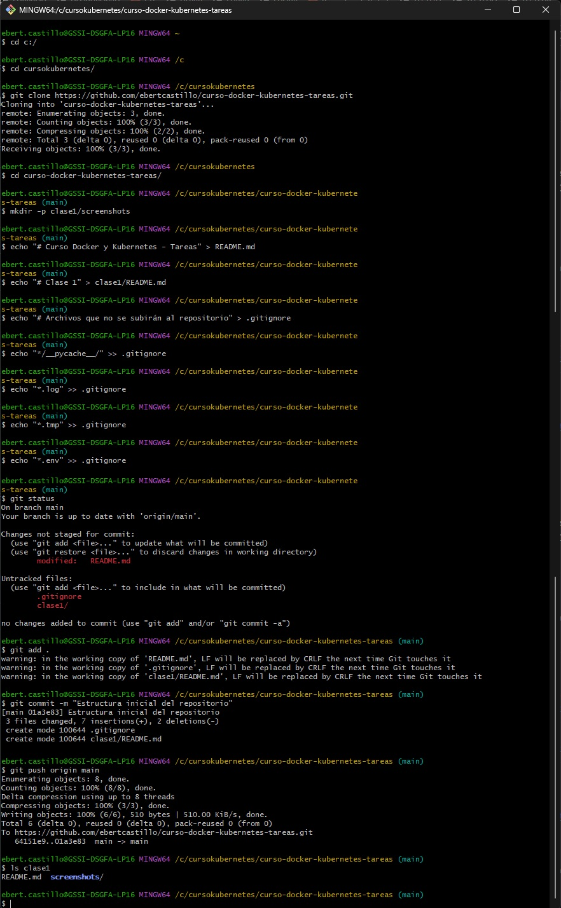
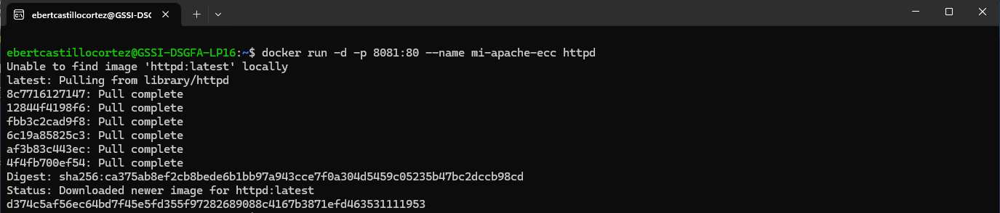
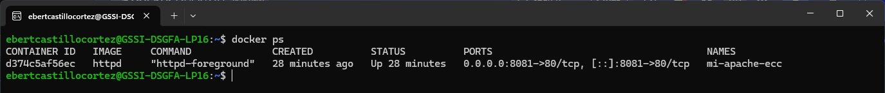
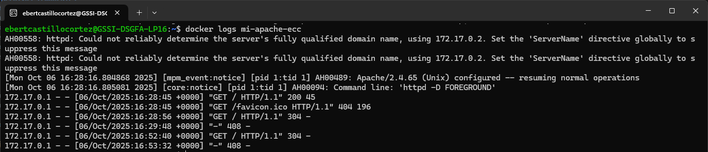
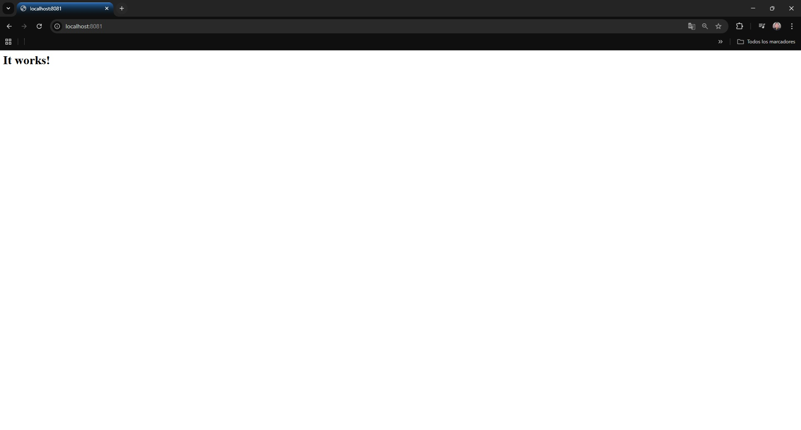
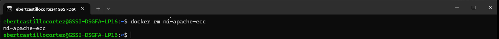
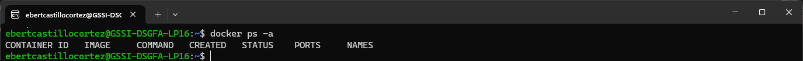

# Clase 1
Tarea 1 - Configuración de Repositorio y Primer Desafío

Parte 1: Configuración del Repositorio Personal

Crea tu repositorio personal donde documentarás todas las tareas del curso.

Instrucciones
Crea un repositorio público en GitHub o GitLab

Nombre sugerido: curso-docker-kubernetes-tareas
Inicialízalo con un README.md
Crea la estructura inicial del repositorio:

mkdir - p clase1/

curso-docker-kubernetes-tareas/
├── README.md
├── clase1/
│   ├── README.md
│   └── screenshots/
└── .gitignore
Configura el README.md principal con:

Título: "Tareas - Curso Docker & Kubernetes"
Tu nombre
Enlace al curso de i-Quattro
Índice con enlaces a cada clase
Crea el archivo .gitignore con contenido básico:

# Archivos del sistema
.DS_Store
Thumbs.db

# Logs
*.log

# Variables de entorno
.env
.env.local

# Archivos temporales
*.tmp
*.swp

Parte 2: Desafío Técnico con Docker
Explora diferentes aplicaciones desplegadas con Docker.

Objetivo
Practicar el despliegue de diferentes tipos de aplicaciones usando docker run y documentar el proceso de cada una.

Aplicaciones a Desplegar
Elige 1 de las siguientes 3 aplicaciones y despliégala:

S elige la Opcion 1

Opción 1: Apache HTTP Server (httpd)
Despliega un servidor web Apache:

Imagen: httpd
Puerto: 8081
Nombre del container: mi-apache
Verifica accediendo a http://localhost:8081
Opción 2: Redis (base de datos clave-valor)
Despliega un servidor Redis:

Tareas a Realizar
Para la aplicación que elegiste:

Nombre de la aplicación - mi-apache-ecc (Apache HTTP Server (httpd))

Ejecutar el container en segundo plano con el puerto y nombre especificados

ebertcastillocortez@GSSI-DSGFA-LP16:~$ docker run -d -p 8081:80 --name mi-apache-ecc httpd

Lista los containers en ejecución

ebertcastillocortez@GSSI-DSGFA-LP16:~$ docker ps

Consulta los logs del container

ebertcastillocortez@GSSI-DSGFA-LP16:~$ docker logs mi-apache-ecc

Accede al servicio (navegador para httpd, logs para redis/mysql)

Limpieza:

Detén el container

ebertcastillocortez@GSSI-DSGFA-LP16:~$ docker stop mi-apache-ecc

Elimínar

ebertcastillocortez@GSSI-DSGFA-LP16:~$ docker rm mi-apache-ecc

Verifica que ya no existe

ebertcastillocortez@GSSI-DSGFA-LP16:~$ docker ps -a

Conclusiones (opcional):

Se logro enteder al despliegue de us servicio apache, y todas los comandos utilizados.
 Gracias 