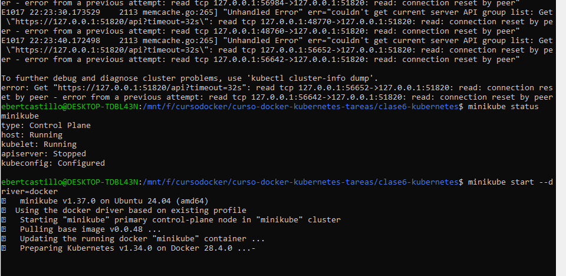
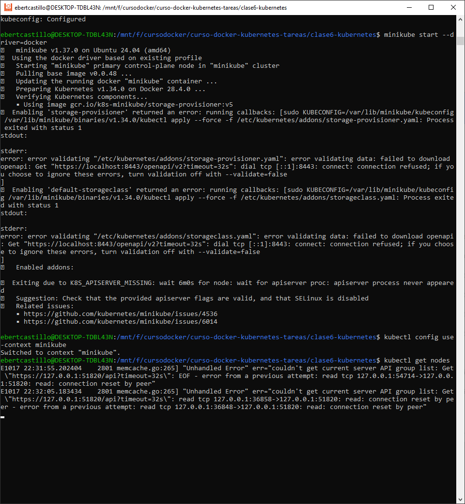
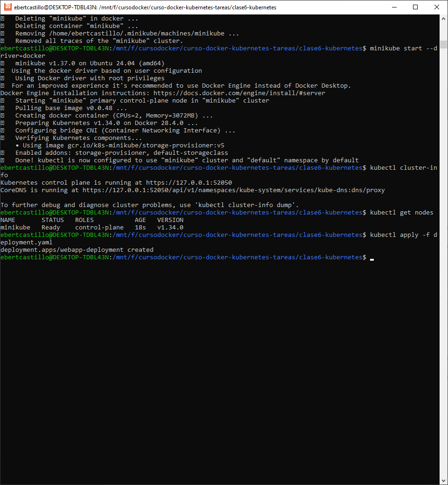
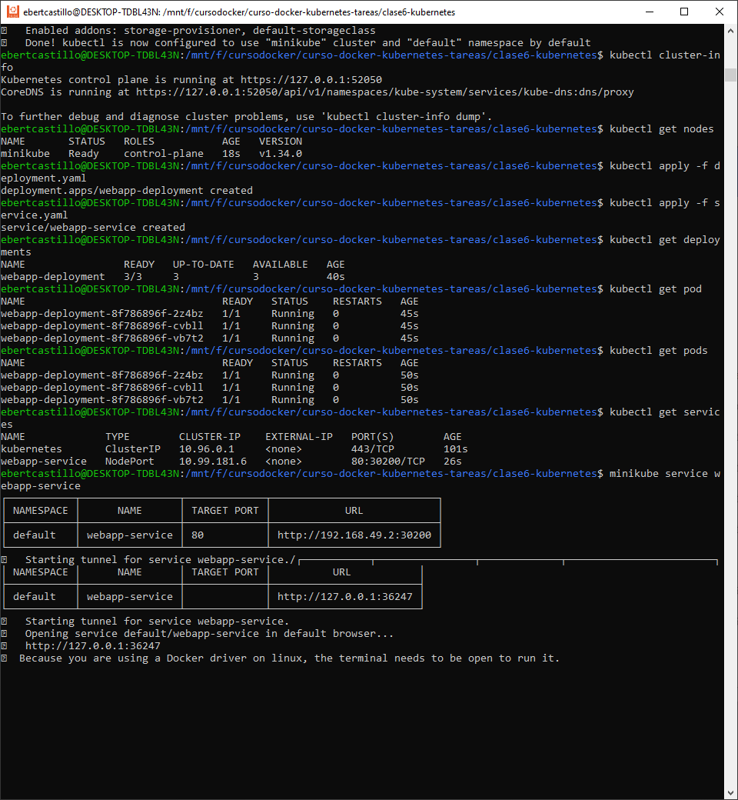
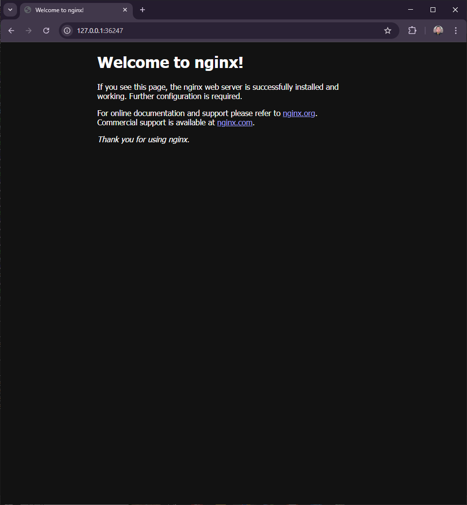
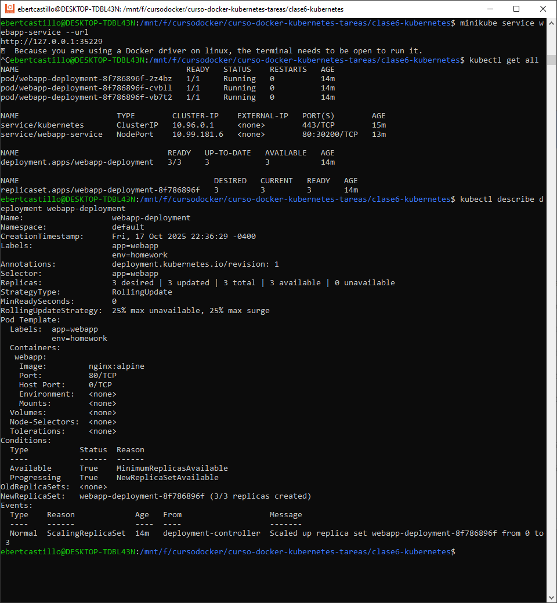
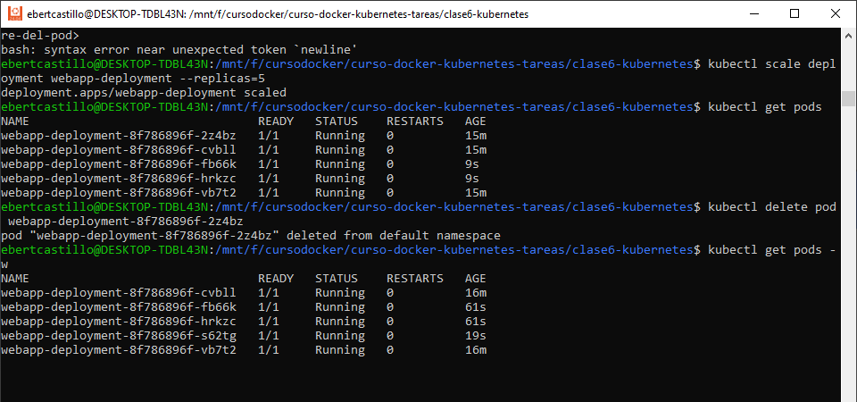

# Webapp 

**Curso:** Docker & Kubernetes - Clase 6  
**Estudiante:** Ebert Castillo Cortez 

Aplicación web simple usando Nginx desplegada en Kubernetes.

## Stack
- **Aplicación:** Nginx
- **Kubernetes:** minikube

## Crear el deployment.yaml

apiVersion: apps/v1
kind: Deployment
metadata:
  name: webapp-deployment
  labels:
    app: webapp
    env: homework
spec:
  replicas: 3
  selector:
    matchLabels:
      app: webapp
  template:
    metadata:
      labels:
        app: webapp
        env: homework
    spec:
      containers:
      - name: webapp
        image: nginx:alpine
        ports:
        - containerPort: 80

## Crear el service.yaml
apiVersion: v1
kind: Service
metadata:
  name: webapp-service
  labels:
    app: webapp
spec:
  type: NodePort
  selector:
    app: webapp
  ports:
  - port: 80
    targetPort: 80
    nodePort: 30200

##  Aplicar Deployment y Service

## Experimentar con Kubernetes

5 Replicas y eliminacion de una de acuerdo con el name

kubectl delete pod name
kubectl get pods -w

